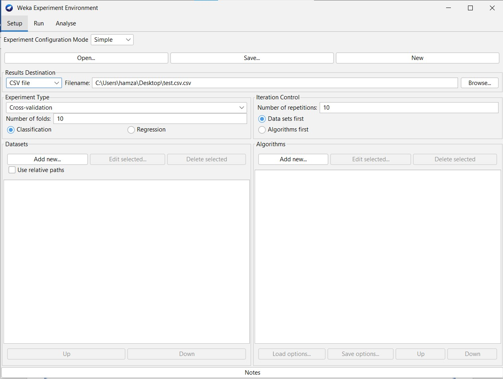
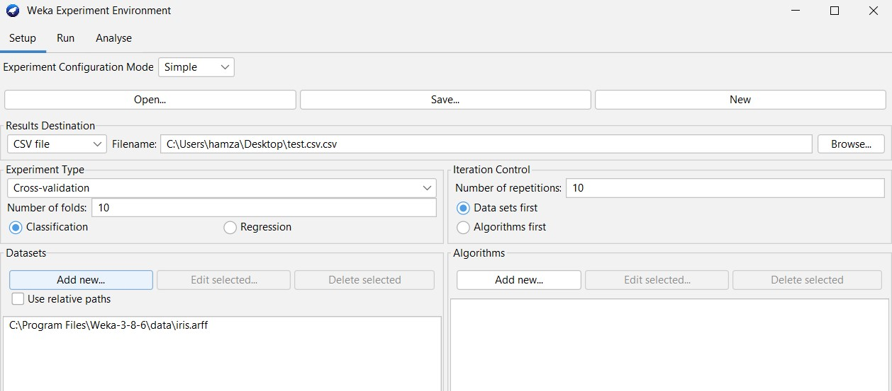
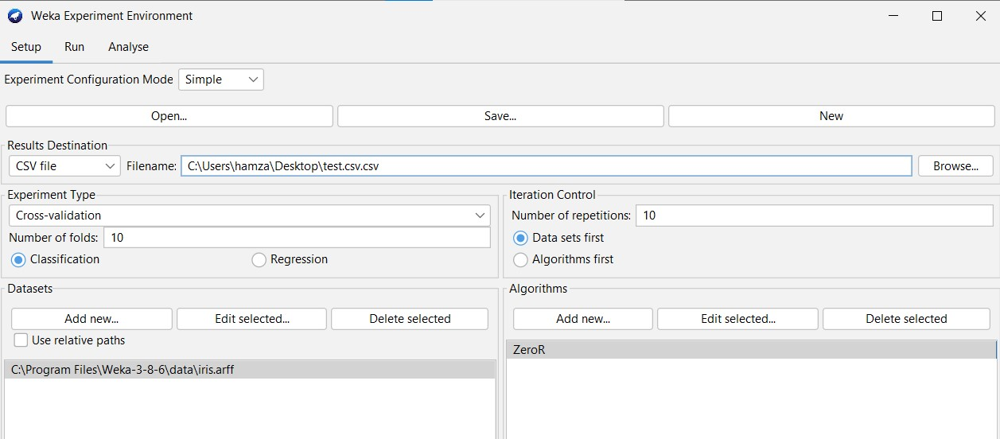
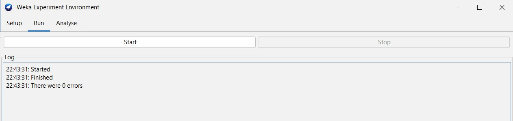
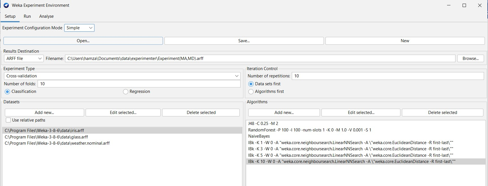
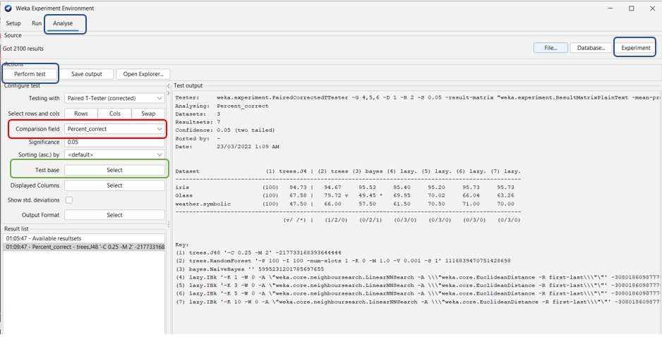
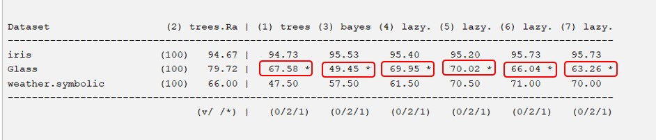
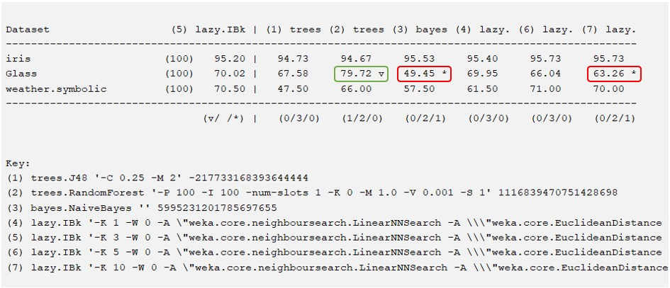

# Weka Experimenter
<div id="top"></div>

<!-- TABLE OF CONTENTS -->
<details>
  <summary>Table of Contents</summary>
  <ol>
    <li>
      <a href="#about-the-project">About Weka Experimenter</a>
    </li>
    <li>
      <a href="#getting-started">Getting Started</a>
    </li>
    <li><a href="#usage">Usage</a></li>
    <ul>
      <li><a href="#launching-experiment">Launching Experiment</a></li>
      <li><a href="#result-file">Result File</a></li>
      <li><a href="#weka-analyzer">Weka Analyzer</a></li>
    </ul>
  </ol>
</details>

## About Weka Experimenter

The Weka Experiment Environment enables you to create, run, modify, and analyze experiments in a more convenient manner than is possible when processing the schemes individually. For example, its possible to create an experiment that runs several schemes against a series of datasets and then analyze the results to determine if one of the schemes is (statistically) better than the other schemes.

<p align="right">(<a href="#top">back to top</a>)</p>

## Getting Started

In order to follow this guide you need to have weka installed.

## Usage
### Launching an experiment

1) Open Weka and choose experiment mode.
2)	Click on the new button then define the result destination and type of file.
&nbsp;&nbsp;&nbsp;&nbsp;
3)	Choose the experiment Type (By default Cross-validation with 10 folds), whether it is a classification or a regression (By default classification).
&nbsp;&nbsp;&nbsp;&nbsp;
4)	Add datasets to your experiment with the add new button in dataset section.You can add more than one dataset to work on (We used ```iris dataset``` for this example)
&nbsp;&nbsp;&nbsp;&nbsp;
5)	Add algorithms to your experiment with the add new button in algorithms section. You can add more than one algorithm to work with (To compare between them).
Configure each algorithm parameters.
&nbsp;&nbsp;&nbsp;&nbsp;
6)	Run the experiment with run button and visualize the results.
&nbsp;&nbsp;&nbsp;&nbsp;
 <p align="right">(<a href="#top">back to top</a>)</p>

### Result file

The first line contains column identifiers such as the dataset name, run number, number of successfully classified instances, number of incorrect classifications, metrics (f-measure…).</br>
**What to keep in order to determine the efficiency of the classifier?**</br>
The most important information’s are the percentages of correcttly and incorrectly classified instances, mean absolute error (quantity used to measure how close forecasts or predictions are to the eventual outcomes) and metrics (recall, precision, F-measure…)
If we want to have an idea on the hardware performance, we can take a look at the CPU time elapsed in each step and data size.
 <p align="right">(<a href="#top">back to top</a>)</p>


### Weka Analyzer

**Experiment**:Use J48, Random Forest, Naive Bayes, IBK k=1, IBK k=3, IBK k=5, IBK k=10 on multiple Datasets (IRIS, Glass, Weather).</br>
We will need ARFF file extension so we can use the analyzer.
&nbsp;&nbsp;&nbsp;&nbsp;
We go to analyze and then click on experiment then perform test.
In this case we are comparing relative to the ```percentage of correctly classified instances```. All the algorithms are compared relatively to **J48** which can be changed (Values stays the same).
&nbsp;&nbsp;&nbsp;&nbsp;

#### Analyzing results

&nbsp;&nbsp;&nbsp;&nbsp;

\*: Significantly worse. </br>
V: Significantly better. 
</br>
**Significance level: 0.05** (it gives us how sure we are that an algorithm is better than other not due to chance or sampling error). </br>
This figure tells us that: </br>
-	All the algorithms are significantly worse than J48 (79.72%) on the Glass dataset.
- IBK3 (70.02%) seems better than Random Forest (67.58%) and IBK1 (69.95%) and IBK5 (66.04%) and significantly better than naïve-bays (49.45%) and IBK10 (63.26%) on the glass dataset.
- The algorithms offer near results on the iris and weather datasets. 

</br>

We can change test base to IBK5 to verify what we said on the Glass dataset: 

&nbsp;&nbsp;&nbsp;&nbsp;
